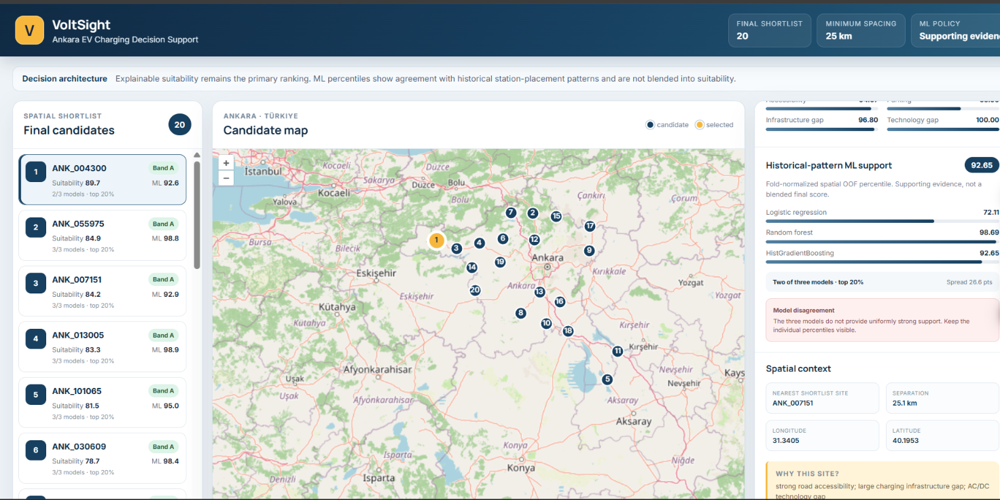
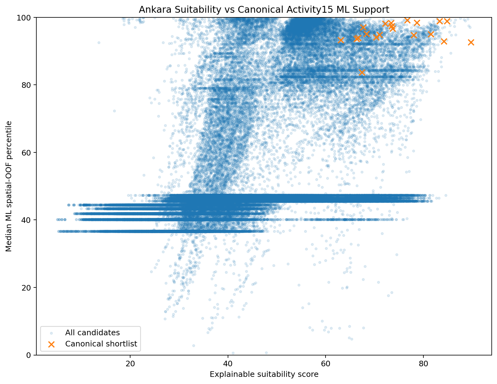

# VoltSight

**Akıllı elektrikli araç şarj istasyonu yer seçimi için açıklanabilir mekânsal karar destek sistemi.**

VoltSight; yeni elektrikli araç şarj istasyonları için güçlü aday bölgeleri belirlemek amacıyla açık coğrafi verileri, mekânsal özellik mühendisliğini, açıklanabilir suitability skorlamasını ve spatial cross-validation ile değerlendirilen makine öğrenmesi katmanını bir araya getiren uçtan uca bir geospatial data science projesidir.

Proje ilk olarak **Çankaya, Ankara** üzerinde 250 × 250 metre çözünürlüklü bir pilot olarak geliştirilmiş, daha sonra veri toplama, feature engineering, suitability ve ML mimarisi **Ankara ili geneline** ölçeklenmiştir.

> **VoltSight'ın ana karar çıktısı bir “istasyon kurulmalı” olasılığı değildir.** Ana çıktı; erişilebilirlik, otopark uygulanabilirliği ve mevcut şarj altyapısı açığını birlikte değerlendiren **açıklanabilir bir suitability sıralamasıdır**. Makine öğrenmesi katmanı ise bu karar modelini destekleyen ayrı bir predictive-evidence katmanı olarak kullanılır.

---

## Ana Sonuçlar

| Ölçüt | Ankara |
|---|---:|
| Çalışma alanı | Ankara ili |
| Yaklaşık sınır alanı | 25.680,96 km² |
| Grid çözünürlüğü | 500 × 500 m |
| Grid hücresi | 102.745 |
| Birleştirilmiş yol parçası | 177.714 |
| Toplam yol uzunluğu | 29.274,14 km |
| Benzersiz OSM otoparkı | 2.959 |
| Nihai analiz şarj istasyonu | 69 |
| Mevcut istasyon içeren grid | 46 |
| Yeni istasyon adayı grid | 102.699 |
| WorldPop Ankara grid toplamı | 6.164.020,56 kişi |
| Benzersiz buffered OSM activity POI | 21.513 |
| Local POI içeren grid | 3.026 |
| Suitability eligibility filtresini geçen aday | 4.954 |
| Nihai spatial shortlist | 20 |
| Minimum shortlist aralığı | 25 km |
| En yüksek suitability | 89,7487 |
| En yüksek aday | `ANK_004300` |
| Shortlist minimum suitability | 63,1078 |
| Canonical ML predictor sayısı | 15 |
| Canonical RF spatial OOF AP | 0,091954 |
| Suitability ↔ fold-normalized ML consensus Spearman | 0,6865 |
| Final 20: ≥2 model candidate top %20 | 20/20 |
| Final 20: ≥2 model candidate top %10 | 19/20 |
| Otomatik test kapsamı | 489 Pytest + 10 Vitest |

---

## Interactive Decision-Support Dashboard



Araştırma ve modelleme çıktıları, read-only FastAPI servisi ve React + TypeScript + OpenLayers arayüzü üzerinden etkileşimli bir karar-destek ekranına taşınmıştır.

Dashboard:

- 25 km spatial-diversity kuralıyla seçilen final 20 adayı listeler,
- adayları Ankara haritasında etkileşimli marker'larla gösterir,
- seçilen adayın suitability, feasibility, need, accessibility, parking, infrastructure-gap ve technology-gap bileşenlerini açıklar,
- Logistic Regression, Random Forest ve HistGradientBoosting için fold-normalized spatial OOF percentile'larını ayrı ayrı gösterir,
- cross-model disagreement durumlarını gizlemek yerine görünür tutar.

> **Karar politikası değişmez:** suitability ana karar katmanıdır. ML support yalnızca historical-pattern supporting evidence'dır ve suitability skoruna blend edilmez.

---

## Ankara Suitability Haritası


Harita, mevcut istasyon hücreleri çıkarıldıktan sonra kalan **102.699 aday grid hücresinin** açıklanabilir suitability skorlarını göstermektedir.

Skorlar Ankara aday dağılımına göre göreli olarak hesaplanır. Bu nedenle yüksek skor, hücrenin Ankara içindeki diğer adaylara kıyasla güçlü bir **feasibility + infrastructure need** kombinasyonuna sahip olduğunu ifade eder.

Suitability skoru:

- olasılık değildir,
- beklenen istasyon kullanımı değildir,
- finansal getiri tahmini değildir,
- doğrudan yatırım kararı değildir.

---

## Final 20 Aday Bölge


En yüksek suitability skoruna sahip ilk 20 hücreyi doğrudan seçmek yerine, yatırım önerilerinin aynı koridor veya kent bölgesinde kümelenmesini azaltmak için greedy spatial-diversity kuralı uygulanır.

Canonical shortlist kuralları:

- suitability ≥ 60
- feasibility ≥ 60
- need ≥ 50
- representative point'ler arasında en az 25 km
- toplam 20 aday

Sonuç:

| Ölçüt | Değer |
|---|---:|
| Eligibility sonrası aday | 4.954 |
| Seçilen aday | 20 |
| Minimum gözlenen spacing | 25,08 km |
| Minimum suitability | 63,1078 |
| Minimum feasibility | 60,2973 |
| Minimum need | 54,3497 |
| Shortlist'teki en kötü orijinal suitability rank | 8.728 |

Spatial diversity yalnızca shortlist seçim aşamasını etkiler. Adayların orijinal suitability skorları değiştirilmez.

---

# Proje Mimarisi

VoltSight Ankara mimarisi üç katmana ayrılır:

1. **Explainable suitability / site-selection**
2. **Spatially validated ML evidence**
3. **Read-only decision-support application**

```text
Ankara Administrative Boundary
              |
              v
        500 x 500 m Grid
              |
      +-------+-------+
      |       |       |
      v       v       v
    Roads   Parking  Charging
      |       |       |
      v       v       v
   Grid-level Feature Engineering
              |
      +-------+----------------------+
      |                              |
      v                              v
Population Context             OSM Urban Activity
(WorldPop 100 m)               POI Proxy
      |                              |
      +--------------+---------------+
                     |
          +----------+----------+
          |                     |
          v                     v
 Historical Leakage-Safe   Suitability Candidate
   ML Dataset (Full14)          Dataset
          |                     |
          v                     v
 Redundancy / Feature      Explainable Scoring
   Family Experiments           |
          |                     v
          v                Quality Filters
  Normalized12                  |
          |                     v
          v              25 km Spatial Diversity
 OSM Activity Validation        |
          |                     v
          v                Final 20 Sites
 Canonical Activity15           |
          |                     |
          v                     |
  5 km Spatial Block CV         |
          |                     |
   +------+------+              |
   |      |      |              |
   v      v      v              |
 Logistic  RF    HGB            |
   \      |      /              |
    \     |     /               |
     v    v    v                 |
 Fold-normalized OOF            |
   Candidate Support            |
          |                     |
          +----------+----------+
                     |
                     v
          Decision-Support Export
              CSV + JSON
                     |
                     v
               FastAPI API
                     |
                     v
       React + TypeScript + OpenLayers
                     |
                     v
        Interactive Ankara Dashboard
```

Suitability ve ML katmanları aynı problem değildir:

- **Suitability** yeni istasyon adayı hücreleri karar destek amacıyla sıralar.
- **ML** mevcut istasyon dağılımında hangi mekânsal özelliklerin predictive signal taşıdığını spatial validation altında inceler.
- **Web uygulaması** bu iki katmanı birleştirmez; mevcut export contract'ını açıklanabilir biçimde sunar.

---

# Çalışma Alanları

## Çankaya Pilot Çalışması

VoltSight'ın ilk prototipi Çankaya üzerinde geliştirilmiştir.

Çankaya pilotu:

- 250 × 250 m grid
- 7.227 grid hücresi
- 7.217 yeni istasyon adayı
- yol, otopark ve charging feature engineering
- explainable suitability
- 20 adaylık spatial shortlist

üretmiştir.

Pilot çalışma; veri modellerinin, leakage politikasının, scoring fonksiyonlarının ve spatial selection mimarisinin geliştirilmesinde kullanılmıştır.

## Ankara Ölçeklendirmesi

Ankara ana çalışması:

```text
Grid resolution:  500 m
Grid cells:        102.745
Analysis CRS:      EPSG:32636
Grid ID format:    ANK_000001 ...
```

Ankara'nın geniş alanı nedeniyle veri toplama işlemlerinde resumable chunking, deterministic caching ve adaptive Overpass sorguları kullanılmıştır.

---

# Veri Hatları

## 1. Yol Veri Hattı

Ankara sürüş ağı tek sorguda işlenmek yerine 8 km core chunk'lara ayrılmıştır.

```text
8 km core chunk
      +
1 km download buffer
      |
      v
OSMnx / Overpass
      |
      v
Per-chunk cache
      |
      v
Resume support
      |
      v
Core clipping
      |
      v
Unified Ankara road network
```

Sonuç:

| Ölçüt | Değer |
|---|---:|
| Aktif chunk | 484 |
| Empty-success chunk | 31 |
| Failed chunk | 0 |
| Final road pieces | 177.714 |
| Main-road pieces | 54.180 |
| Toplam yol uzunluğu | 29.274,14 km |

Grid-level road features:

- `road_length_m`
- `road_segment_count`
- `main_road_length_m`
- `main_road_segment_count`
- `road_density_km_per_km2`
- `distance_to_main_road_m`

Ankara özeti:

- road data bulunan grid: 28.676
- road data bulunmayan grid: 74.069
- ortalama road density: 1,14 km/km²
- medyan ana-yol mesafesi: 958,35 m
- maksimum ana-yol mesafesi: 23.080,08 m

---

## 2. Otopark Veri Hattı

OpenStreetMap `amenity=parking` nesneleri chunk bazlı indirilir ve OSM kimlikleri üzerinden deduplicate edilir.

| Ölçüt | Değer |
|---|---:|
| Ham parking record | 4.623 |
| Removed duplicate | 1.664 |
| Unique parking feature | 2.959 |
| Capacity bilgisi bulunan feature | 113 |

Grid-level parking features:

- `parking_count`
- `parking_area_m2`
- `parking_area_ratio`
- `distance_to_nearest_parking_m`
- `parking_count_within_500m`
- `parking_count_within_1000m`
- `known_parking_capacity`
- `parking_capacity_record_count`

Ankara özeti:

- local parking bulunan grid: 984
- 500 m içinde parking bulunan grid: 1.906
- 1 km içinde parking bulunan grid: 3.960
- medyan nearest-parking distance: 11.823,59 m
- maksimum nearest-parking distance: 64.185,46 m

> OSM parking coverage ve capacity etiketleri eksik olabilir. Bu feature'lar resmi ve eksiksiz bir otopark envanteri değil, **haritalanmış otopark erişilebilirliği proxy'sidir**.

---

## 3. Şarj İstasyonu Veri Hattı

Charging data, yol verisine kıyasla seyrek olduğu için Ankara genelinde `amenity=charging_station` sorgusu kullanan hızlı bir Overpass pipeline'ı geliştirilmiştir.

Çankaya pilotundaki 18 OSM istasyonunun 18'i Ankara-wide sorguda yeniden bulunmuştur.

Nihai analiz envanteri:

| Kaynak / ölçüt | Değer |
|---|---:|
| OSM charging station | 68 |
| Daha önce incelenmiş EPDK supplemental coordinate | 1 |
| Final analysis stations | 69 |
| AC etiketi bulunan station | 13 |
| DC etiketi bulunan station | 7 |

> EPDK bileşeni Ankara geneli için eksiksiz bir koordinatlı EPDK istasyon envanteri değildir. Yalnızca daha önce incelenmiş tek supplemental kayıttır.

Grid-level charging features:

- `charging_station_count`
- `has_existing_charging_station`
- `distance_to_nearest_charging_station_m`
- `charging_station_count_within_1000m`
- `charging_station_count_within_2000m`
- `known_charging_capacity`
- `charging_capacity_record_count`
- `ac_station_count_within_1000m`
- `dc_station_count_within_1000m`

Ankara özeti:

- station içeren grid: 46
- 1 km içinde station bulunan grid: 463
- 2 km içinde station bulunan grid: 1.399
- medyan nearest-station distance: 31.631,14 m
- maksimum nearest-station distance: 125.676,81 m

---

## 4. WorldPop Population Context

Residential population context için **WorldPop 2025 R2024B constrained 100 m** rasterı kullanılır.

Kaynak özellikleri:

- ülke: Türkiye
- yıl: 2025
- ürün: constrained population
- çözünürlük: yaklaşık 100 m
- değer: kişi / pixel
- CRS: WGS84
- release: R2024B
- lisans: CC BY 4.0
- DOI: `10.5258/SOTON/WP00803`

Ankara grid feature'ları:

- `population_count`
- `population_density_per_km2`
- `population_within_1000m`
- `population_within_2000m`

500 m grid sabit alanlı olduğu için `population_density_per_km2`, `population_count` ile deterministik ölçek ilişkisine sahiptir ve ML predictor setinde ikisini birlikte kullanmak gerekli değildir.

Population mass validation:

| Ölçüt | Değer |
|---|---:|
| Ankara boundary içi WorldPop | 6.164.255,64 |
| Grid'e aktarılan WorldPop | 6.164.020,56 |
| Grid aktarım farkı | -0,0038% |
| TÜİK 2025 Ankara aggregate benchmark | 5.910.320 |
| WorldPop - TÜİK farkı | +4,30% |

WorldPop değerleri TÜİK toplamına **rescale edilmemiştir**. TÜİK burada yalnızca external aggregate benchmark olarak kullanılır.

Population incremental-value ve shortlist sensitivity deneyleri, residential population'ın önemli bir context layer olduğunu ancak canonical suitability veya canonical ML predictor setine eklenmesini destekleyecek kadar model-general ve stabil bir kazanç üretmediğini göstermiştir.

Bu nedenle population:

- suitability içine gömülmez,
- canonical ML predictor setine eklenmez,
- explicit residential-demand/context layer olarak korunur.

---

## 5. OSM Urban Activity Proxy

Residential population yalnızca insanların nerede yaşadığını temsil eder. Ticari, eğitim, sağlık ve ulaşım aktivitesine ilişkin ek context için OSM tabanlı bir **urban activity proxy** geliştirilmiştir.

Activity taxonomy:

- `shop=*`
- `office=*`
- retail / food / finance amenities
- education amenities
- healthcare tags and amenities
- public transport / bus stop / railway / station / terminal-related tags

Charging station ve parking nesneleri bu taxonomy'den bilinçli olarak çıkarılır; çünkü bunlar ayrı feature family'leri olarak modellenir.

Downloader:

- province-wide public Overpass endpoint fallback kullanır,
- broad tag family'lerinde adaptive recursive tiling uygular,
- transient 429 / 5xx durumlarında retry + backoff kullanır,
- successful tile ve query payload'larını cache'ler,
- OSM object'lerini `(type, id)` üzerinden deduplicate eder.

Sonuç:

| Ölçüt | Değer |
|---|---:|
| Buffered unique OSM activity POI | 21.513 |
| Local POI içeren grid | 3.026 |
| `poi_count_within_1000m` nonzero coverage | yaklaşık %9,32 |
| `poi_count_within_2000m` nonzero coverage | yaklaşık %18,74 |

Ana total-activity feature'ları:

- `poi_count`
- `poi_count_within_1000m`
- `poi_count_within_2000m`

Category context feature'ları da üretilir:

- retail / commercial
- education
- healthcare
- transport activity

Ancak category-specific feature setleri canonical ML predictor setine alınmamıştır. Spatial OOF deneylerinde en model-general signal, target-agnostic **total POI context** setinden gelmiştir.

> OSM activity gerçek trip, employment, turnover, traffic veya EV demand ölçümü değildir. Haritalanmış urban activity proxy'sidir ve mapping completeness mekânsal olarak heterojen olabilir.

---

# Leakage-Safe Veri Tasarımı

Mevcut charging station dağılımını öğrenen bir modelde, aynı charging dağılımından türetilmiş feature'ların predictor olarak kullanılması veri sızıntısı yaratır.

Bu nedenle VoltSight iki görevi ayırır.

## Historical ML Training Dataset

Historical Full14 dataset:

```text
Rows:                    102.745
Predictors:                   14
Positive target rows:         46
Negative target rows:    102.699
Charging-derived leakage:      0
```

Full14 predictor'ları yalnızca road + parking feature'larından oluşur.

Charging-derived aşağıdaki context feature'ları ML predictor değildir:

- `distance_to_nearest_charging_station_m`
- `charging_station_count_within_1000m`
- `charging_station_count_within_2000m`
- `ac_station_count_within_1000m`
- `dc_station_count_within_1000m`

## Candidate Site Dataset

Mevcut station içeren grid'ler çıkarıldığında:

```text
Candidate rows: 102.699
```

kalır.

Suitability probleminde charging scarcity doğrudan **need** bileşenidir. Bu nedenle charging context candidate-site decision support içinde kullanılabilir.

Bu iki görev metodolojik olarak farklıdır:

```text
Existing-station ML
    -> charging-derived predictors forbidden

Candidate suitability
    -> charging scarcity allowed as explicit need signal
```

---

# Explainable Suitability Model

VoltSight suitability modeli dört açıklanabilir alt bileşen üzerine kuruludur.

## Accessibility

```text
Main-road proximity   45%
Main-road presence    35%
Road density          20%
```

## Parking

```text
Nearest parking proximity   45%
Parking within 1 km          35%
Local parking area           20%
```

## Infrastructure Gap

```text
Nearest charging distance      75%
Station scarcity within 2 km   25%
```

## Technology Gap

```text
DC absence within 1 km   60%
AC absence within 1 km   40%
```

Bileşim:

```text
Feasibility =
    0.60 * Accessibility
  + 0.40 * Parking

Need =
    0.85 * Infrastructure Gap
  + 0.15 * Technology Gap

Suitability =
    sqrt(Feasibility * Need)
```

Geometrik ortalama, yalnızca feasibility veya yalnızca need değeri yüksek olan dengesiz adayların final skorda aşırı öne çıkmasını sınırlar.

Sparse count feature'larında sıfır değerlerin percentile tie nedeniyle yapay şekilde yüksek skor almasını önlemek için zero-preserving scoring helper'ları kullanılır.

## Ankara Suitability Sonuçları

```text
Candidate count:       102.699
Median suitability:      38,1239
Maximum suitability:     89,7487
Minimum suitability:      5,0353

Priority A:              1.027
Priority B:              4.108
Priority C:             15.405
Priority D:             30.810
Priority E:             51.349
```

En yüksek aday:

```text
Grid ID:             ANK_004300
Suitability score:      89,7487
```

Priority band'leri Ankara aday dağılımındaki göreli yüzdeliklere göre oluşturulur.

---

# Makine Öğrenmesi Mimarisi

ML katmanı mevcut charging-station hücrelerini nadir pozitif sınıf olarak ele alır.

```text
Rows:       102.745
Positive:        46
Negative:   102.699
Prevalence: ~0,0448%
```

Bu nedenle **accuracy primary metric değildir**.

Primary / supporting metrics:

- Average Precision / PR-AUC
- top-1% recall and lift
- top-5% recall and lift
- fold-level AP
- ROC-AUC secondary diagnostic

## Spatial Block Cross-Validation

Ankara için:

- 5 km spatial blocks
- 1.157 spatial block
- 5 folds
- her fold yaklaşık 20.549 row
- pozitifler fold'lara 10 / 9 / 9 / 9 / 9 olarak dağıtılır

Aynı spatial block içindeki hücreler aynı fold'da tutulur.

> Bu yaklaşım local train-validation dependence'i azaltır ancak komşu block'lar farklı fold'lara düşebileceği için tüm spatial autocorrelation'ı ortadan kaldırmaz.

---

## Feature Architecture: Full14 → Normalized12 → Activity15

### Historical Full14

İlk leakage-safe baseline:

- 6 road feature
- 8 parking feature
- toplam 14 predictor

### Redundancy Audit

İki near-deterministic feature çifti bulundu:

```text
road_length_m
    ~ road_density_km_per_km2

parking_area_m2
    ~ parking_area_ratio
```

Bu nedenle forward-looking baseline'da raw scale duplicate'ları çıkarıldı:

```text
removed:
- road_length_m
- parking_area_m2
```

### Normalized12

Deduplicated road/parking set:

```text
12 predictor
```

Logistic Regression ve HistGradientBoosting performansı pratik olarak korunurken Random Forest pooled AP beş fixed seed'in 5/5'inde Full14'e göre yükseldi.

### Population Experiment

WorldPop context ayrı feature family olarak test edildi.

Sonuç:

- bazı modellerde küçük kazançlar,
- bazı modellerde düşüş,
- model-general ve stabil incremental value yok.

Population canonical ML predictor setine alınmadı.

### OSM Activity Experiment

Target-agnostic total POI context:

```text
poi_count
poi_count_within_1000m
poi_count_within_2000m
```

Normalized12'ye eklendiğinde pooled spatial OOF AP üç modelde de yükseldi.

Random Forest seed-stability kontrolünde Activity15 pooled AP:

- 5 seed'in 4'ünde Normalized12'den yüksek,
- mean paired AP delta yaklaşık +0,0124,
- fold-level AP ve top-5% recall seed'ler arasında değişken.

Bunun sonucunda forward-looking canonical feature architecture:

```text
Canonical Activity15
=
Normalized12
+
3 total OSM activity context features
```

olarak tanımlandı.

---

## Canonical Activity15 Predictor Set

```text
road_segment_count
main_road_length_m
main_road_segment_count
road_density_km_per_km2
distance_to_main_road_m

parking_count
parking_area_ratio
distance_to_nearest_parking_m
parking_count_within_500m
parking_count_within_1000m
known_parking_capacity
parking_capacity_record_count

poi_count
poi_count_within_1000m
poi_count_within_2000m
```

Canonical set dışında bırakılan başlıca feature'lar:

```text
road_length_m
parking_area_m2
population_*
category-specific POI features
charging-derived context/leakage features
```

---

# Canonical Activity15 ML Sonuçları

Aynı 5 km spatial folds altında, hyperparameter tuning yapılmadan existing model configuration'ları yeniden değerlendirilmiştir.

| Model | Pooled AP | Mean Fold AP | Fold AP Std | ROC-AUC | Top 1% Recall | Top 5% Recall |
|---|---:|---:|---:|---:|---:|---:|
| Logistic Regression | 0,040671 | 0,064621 | 0,026692 | 0,955376 | 0,500000 | 0,847826 |
| Random Forest | **0,091954** | 0,107259 | 0,116055 | **0,963001** | 0,478261 | **0,913043** |
| HistGradientBoosting | 0,089014 | **0,130608** | 0,115073 | 0,899662 | 0,434783 | 0,826087 |

Ranking lift:

| Model | Top 1% Lift | Top 5% Lift |
|---|---:|---:|
| Logistic Regression | **49,97×** | 16,95× |
| Random Forest | 47,80× | **18,26×** |
| HistGradientBoosting | 43,45× | 16,52× |

Yorum:

- **Random Forest**, pooled spatial OOF AP ve top-5% recall açısından en güçlü canonical ranking reference'tır.
- **Logistic Regression**, fold AP variability açısından en stabil benchmark'tır.
- **HistGradientBoosting**, güçlü nonlinear supporting evidence üretir ancak fold variability yüksektir.

Bu sonuçlar:

- production readiness kanıtı değildir,
- external validation değildir,
- calibrated station probability değildir,
- causal importance kanıtı değildir.

46 positive cell nedeniyle belirsizlik ve fold variability raporlamanın merkezinde tutulur.

---


# Candidate-Level ML Support Diagnostic

Canonical model evaluation tamamlandıktan sonra ML skorları suitability skoruna
karıştırılmaz. Bunun yerine candidate-level ikinci bir evidence axis oluşturulur.

Önemli metodoloji noktası: OOF skorları beş farklı fold-specific modelden
geldiği için raw score'lar Ankara genelinde doğrudan rank edilmez.

Her model için:

```text
held-out spatial fold OOF score
        ↓
same-fold candidate percentile
        ↓
0-100 fold-normalized rank
```

hesaplanır.

Daha sonra Logistic Regression, Random Forest ve HistGradientBoosting
percentile'larının medyanı cross-model ML consensus olarak kullanılır.

Bu değer:

- calibrated probability değildir,
- suitability'nin parçası değildir,
- yeni blended canonical score değildir,
- historical mapped station-placement pattern ile agreement diagnostic'idir.

## Province-Wide Agreement

```text
Candidates:                              102.699
Suitability ↔ ML consensus Spearman:      0,6865

Top 1% suitability / ML overlap:          1,17%
Top 5% suitability / ML overlap:          8,88%
Top 10% suitability / ML overlap:        30,41%
```

Bu sonuç iki katmanın ilişkili ancak aynı olmadığını gösterir.

Suitability infrastructure gap ve feasibility'yi açık biçimde ödüllendirirken,
ML mevcut 46 station hücresinin historical spatial pattern'ını öğrenir.

## Final 20 ML Support

```text
Median ML consensus percentile:          95,03
Minimum ML consensus percentile:         83,66
Maximum ML consensus percentile:         99,14
Median cross-model spread:                3,00

>= 2 model candidate top 20%:            20/20
all 3 model candidate top 20%:           15/20
>= 2 model candidate top 10%:            19/20
```

Dolayısıyla province-wide top ranking'ler birebir örtüşmese de spatially diverse
final shortlist iki bağımsız analitik katmandan güçlü destek almaktadır.

Bazı adaylarda model disagreement ayrıca görünür tutulur. Örneğin:

- `ANK_073387`: LR/RF yüksek, HGB belirgin düşük
- `ANK_066425`: RF/HGB yüksek, Logistic belirgin düşük
- `ANK_093670`: final 20 içindeki en düşük ML consensus örneklerinden biri

Bu disagreement'lar saklanmaz veya tek bir ortalama skor altında gizlenmez.

Aşağıdaki görsel suitability ile fold-normalized spatial OOF ML support
arasındaki ilişkiyi gösterir:




# Suitability ve ML Neden Ayrı?

VoltSight'ta suitability ile ML birbirinin yerine kullanılmaz.

## Suitability

Yeni aday bölgeler için:

- accessibility
- parking feasibility
- infrastructure gap
- technology gap

bileşenlerini açık bir karar modeliyle birleştirir.

## ML

Mevcut station dağılımında:

- hangi predictor family'lerinin spatial validation altında predictive signal taşıdığını,
- bu signal'ın model family'leri arasında ne kadar tutarlı olduğunu,
- feature architecture değişikliklerinin ranking performansını nasıl etkilediğini

inceler.

Bu nedenle final site recommendation'ın ana katmanı **suitability + eligibility + spatial diversity** olmaya devam eder.

ML, supporting predictive evidence olarak raporlanır.

---

# Sonuç Görselleştirmeleri

Ana görseller:

```text
docs/ankara_suitability_map.png
docs/ankara_final_shortlist_map.png
docs/ankara_suitability_distribution.png
docs/ankara_feasibility_need_plot.png
docs/ankara_activity_feature_correlations.png
docs/ankara_activity_incremental_value.png
docs/ankara_activity_category_context.png
docs/ankara_canonical_ml_model_comparison.png
docs/ankara_canonical_spatial_permutation_importance.png
docs/ankara_suitability_ml_support.png
```

Özellikle:

- `ankara_suitability_map.png`: province-wide candidate suitability
- `ankara_final_shortlist_map.png`: 25 km spacing sonrası final 20
- `ankara_feasibility_need_plot.png`: feasibility / need dengesi
- `ankara_activity_feature_correlations.png`: OSM activity redundancy audit
- `ankara_canonical_ml_model_comparison.png`: Activity15 model AP karşılaştırması
- `ankara_canonical_spatial_permutation_importance.png`: canonical feature dependence
- `ankara_suitability_ml_support.png`: suitability ile fold-normalized ML agreement

---

# Test ve Veri Doğrulama

VoltSight pipeline'larında Pytest; web istemcisinde ise Vitest + React Testing Library tabanlı otomatik kontroller kullanılır.

Python tarafında kontrol edilen konular arasında:

- CRS doğruluğu
- geometry validity
- grid ID uniqueness
- missing / non-finite values
- road length / density
- nearest-road distance
- parking radius counts
- parking area calculations
- charging radius relationships
- AC/DC feature semantics
- leakage policy
- zero-preserving percentile scoring
- suitability score bounds
- priority bands
- spatial shortlist spacing
- spatial CV folds
- feature redundancy
- population mass preservation
- OSM activity category / neighborhood logic
- Canonical Activity15 schema
- canonical model evaluation
- validation-fold permutation importance
- fold-normalized OOF candidate-support ranking
- shortlist ML-support agreement
- decision-support export contract
- FastAPI summary / candidate endpoint davranışları

Frontend tarafında:

- candidate-list rendering ve selected state
- candidate selection callback
- suitability ile ML support'un ayrı gösterimi
- cross-model disagreement / agreement rendering
- API route construction
- candidate ID encoding
- backend error detail propagation

Latest validated test snapshot:

```text
Python / Pytest:    489 passed, 3 warnings
Frontend / Vitest:  10 passed
Frontend build:     Vite production build passed
```

Python testleri:

```powershell
python -m pytest -q
```

Frontend testleri:

```powershell
Set-Location ".\frontend"
npm run test:run
```

Production frontend build:

```powershell
npm run build
```

---

# Proje Yapısı

```text
voltsight-ai/
|
|-- data/
|   |-- raw/
|   |   `-- worldpop/
|   |-- interim/
|   `-- processed/
|
|-- docs/
|   |-- voltsight_dashboard.png
|   |-- ankara_suitability_map.png
|   |-- ankara_final_shortlist_map.png
|   |-- ankara_suitability_distribution.png
|   |-- ankara_feasibility_need_plot.png
|   |-- ankara_activity_feature_correlations.png
|   |-- ankara_canonical_ml_model_comparison.png
|   |-- ankara_canonical_spatial_permutation_importance.png
|   |-- ankara_suitability_ml_support.png
|   `-- technical summaries
|
|-- src/
|   `-- voltsight/
|       |
|       |-- core/
|       |   |-- study_areas.py
|       |   `-- ankara_ml_features.py
|       |
|       |-- data/
|       |   |-- create_study_grid.py
|       |   |-- merge_charging_station_sources.py
|       |   `-- merge_ankara_charging_sources.py
|       |
|       |-- features/
|       |   |-- create_ankara_road_chunk_plan.py
|       |   |-- download_ankara_road_chunks.py
|       |   |-- merge_ankara_road_chunks.py
|       |   |-- create_ankara_road_features.py
|       |   |-- download_ankara_parking_chunks.py
|       |   |-- merge_ankara_parking_chunks.py
|       |   |-- create_ankara_parking_features.py
|       |   |-- download_ankara_charging_fast.py
|       |   |-- create_ankara_charging_features.py
|       |   |-- create_ankara_population_features.py
|       |   |-- download_ankara_activity_pois.py
|       |   |-- create_ankara_activity_features.py
|       |   |-- create_ankara_model_dataset.py
|       |   `-- create_ankara_canonical_ml_dataset.py
|       |
|       `-- models/
|           |-- create_ankara_suitability_scores.py
|           |-- create_ankara_diverse_candidate_shortlist.py
|           |-- create_ankara_result_visualizations.py
|           |-- create_ankara_spatial_cv_folds.py
|           |-- evaluate_ankara_canonical_ml_models.py
|           |-- analyze_ankara_canonical_spatial_permutation_importance.py
|           |-- analyze_ankara_candidate_ml_support.py
|           `-- create_ankara_decision_support_export.py
|
|-- backend/
|   `-- app/
|       |-- core/config.py
|       |-- routers/candidates.py
|       |-- schemas/candidates.py
|       |-- services/candidate_service.py
|       `-- main.py
|
|-- frontend/
|   |-- src/
|   |   |-- components/
|   |   |-- services/
|   |   |-- test/
|   |   |-- types/
|   |   |-- App.tsx
|   |   `-- main.tsx
|   |-- package.json
|   |-- vite.config.ts
|   `-- vitest.config.ts
|
|-- tests/
|-- notebooks/
|-- pytest.ini
|-- requirements.txt
`-- README.md
```

---

# Yerel Kurulum

Depoyu klonlayın:

```powershell
git clone https://github.com/ilginbor/voltsight-ai.git
cd voltsight-ai
```

Python sanal ortamını oluşturun:

```powershell
python -m venv .venv
```

Windows PowerShell üzerinde etkinleştirin:

```powershell
Set-ExecutionPolicy -Scope Process -ExecutionPolicy Bypass
.\.venv\Scripts\Activate.ps1
```

Python bağımlılıklarını kurun:

```powershell
python -m pip install --upgrade pip
python -m pip install -r requirements.txt
```

Backend'i başlatın:

```powershell
python -m uvicorn backend.app.main:app --reload
```

Backend varsayılan olarak:

```text
http://127.0.0.1:8000
```

üzerinde çalışır. OpenAPI / Swagger arayüzü:

```text
http://127.0.0.1:8000/docs
```

Yeni bir terminalde frontend'i kurup başlatın:

```powershell
Set-Location ".\frontend"
npm install
npm run dev
```

Frontend development URL:

```text
http://127.0.0.1:5173
```

Vite development proxy, `/api` ve `/health` isteklerini local FastAPI servisine yönlendirir.

## Read-Only API Contract

Ana endpoint'ler:

| Method | Endpoint | Açıklama |
|---|---|---|
| GET | `/health` | Servis ve decision-support veri durumu |
| GET | `/api/v1/summary` | Schema, study-area ve decision-policy özeti |
| GET | `/api/v1/candidates` | Final 20 candidate listesi |
| GET | `/api/v1/candidates/{grid_id}` | Tek candidate için ayrıntılı suitability + ML support |

API request sırasında model retraining yapmaz. Önceden doğrulanmış decision-support JSON export'unu schema validation ve service katmanı üzerinden read-only olarak sunar.

---

# Ankara Pipeline

## 1. Study Grid

```powershell
python ".\src\voltsight\data\create_study_grid.py" `
    --study-area ankara `
    --grid-size-m 500 `
    --reuse-boundary
```

## 2. Road Pipeline

```powershell
python ".\src\voltsight\features\create_ankara_road_chunk_plan.py"

python ".\src\voltsight\features\download_ankara_road_chunks.py" `
    --all `
    --start-order 1

python ".\src\voltsight\features\merge_ankara_road_chunks.py"

python ".\src\voltsight\features\create_ankara_road_features.py"
```

Road downloader tamamlanan chunk'ları metadata üzerinden atlar ve eksik parçalardan devam eder.

## 3. Parking Pipeline

```powershell
python ".\src\voltsight\features\download_ankara_parking_chunks.py" `
    --all `
    --start-order 1

python ".\src\voltsight\features\merge_ankara_parking_chunks.py"

python ".\src\voltsight\features\create_ankara_parking_features.py" `
    --batch-size 5000 `
    --skip-preview
```

## 4. Charging Pipeline

```powershell
python ".\src\voltsight\features\download_ankara_charging_fast.py"

python ".\src\voltsight\data\merge_ankara_charging_sources.py"

python ".\src\voltsight\features\create_ankara_charging_features.py" `
    --batch-size 5000 `
    --skip-preview
```

## 5. Historical Full14 Model Dataset

```powershell
python ".\src\voltsight\features\create_ankara_model_dataset.py"
```

## 6. Explainable Suitability

```powershell
python ".\src\voltsight\models\create_ankara_suitability_scores.py"
```

## 7. Spatial Shortlist

```powershell
python ".\src\voltsight\models\create_ankara_diverse_candidate_shortlist.py"
```

## 8. Result Visualizations

```powershell
python ".\src\voltsight\models\create_ankara_result_visualizations.py"
```

## 9. Population Context

WorldPop rasterı `data/raw/worldpop/` altında mevcut olduktan sonra:

```powershell
python ".\src\voltsight\features\create_ankara_population_features.py"
```

## 10. OSM Urban Activity

```powershell
python ".\src\voltsight\features\download_ankara_activity_pois.py"

python ".\src\voltsight\features\create_ankara_activity_features.py"
```

Successful Overpass cache'lerini korumak için normal resume çalıştırmalarında `--refresh` kullanılmaz.

## 11. Canonical Activity15 Dataset

```powershell
python ".\src\voltsight\features\create_ankara_canonical_ml_dataset.py"
```

Outputs:

```text
data/processed/ankara_canonical_ml_training_dataset.csv
data/processed/ankara_canonical_ml_candidate_dataset.csv
docs/ankara_canonical_ml_dataset_summary.md
```

## 12. Spatial CV

```powershell
python ".\src\voltsight\models\create_ankara_spatial_cv_folds.py"
```

## 13. Canonical Activity15 Evaluation

```powershell
python ".\src\voltsight\models\evaluate_ankara_canonical_ml_models.py"
```

Outputs:

```text
data/processed/ankara_canonical_ml_model_metrics.csv
data/processed/ankara_canonical_ml_model_fold_metrics.csv
data/processed/ankara_canonical_ml_model_oof_predictions.csv
docs/ankara_canonical_ml_model_summary.md
docs/ankara_canonical_ml_model_comparison.png
```

## 14. Canonical Spatial Permutation Importance

```powershell
python ".\src\voltsight\models\analyze_ankara_canonical_spatial_permutation_importance.py"
```

Outputs:

```text
data/processed/ankara_canonical_spatial_permutation_importance.csv
data/processed/ankara_canonical_spatial_permutation_importance_fold_drops.csv
docs/ankara_canonical_spatial_permutation_importance_summary.md
docs/ankara_canonical_spatial_permutation_importance.png
```

## 15. Candidate ML Support Diagnostic

```powershell
python ".\src\voltsight\models\analyze_ankara_candidate_ml_support.py"
```

Outputs:

```text
data/processed/ankara_candidate_ml_support.csv
data/processed/ankara_shortlist_ml_support.csv
data/processed/ankara_candidate_ml_support_metrics.csv
docs/ankara_candidate_ml_support_summary.md
docs/ankara_suitability_ml_support.png
```

---


## 16. Decision-Support Export

```powershell
python ".\src\voltsight\models\create_ankara_decision_support_export.py"
```

Outputs:

```text
data/processed/ankara_decision_support_shortlist.csv
data/processed/ankara_decision_support_shortlist.json
docs/ankara_decision_support_export_summary.md
```

Export contract, final 20 shortlist ile fold-normalized candidate ML support verisini tek read-only uygulama payload'ında birleştirir. `ml_is_blended_into_suitability` alanı `false` olarak korunur.

---

# Kullanılan Teknolojiler

## Veri Bilimi ve ML

- Python
- NumPy
- Pandas
- SciPy
- scikit-learn
- Matplotlib

## Coğrafi Veri İşleme

- OpenStreetMap
- Overpass API
- OSMnx
- GeoPandas
- Shapely
- PyProj
- Pyogrio
- GeoPackage
- GeoJSON
- GeoTIFF
- OpenLayers

## Backend ve API

- FastAPI
- Pydantic
- Uvicorn
- OpenAPI / Swagger
- read-only JSON data-serving service

## Frontend

- React
- TypeScript
- Vite
- OpenLayers
- responsive dashboard UI

## Test ve Yazılım Mühendisliği

- Pytest
- Vitest
- React Testing Library
- Git
- GitHub
- chunk-based processing
- deterministic caching
- checkpoint / resume
- reproducible pipelines
- schema validation

---

# Bilimsel ve Veri Kaynağı Sınırlamaları

VoltSight sonuçları açık veri kaynaklarının kapsamına bağlıdır.

Başlıca sınırlamalar:

- OSM road coverage güçlü olsa da parking ve POI completeness mekânsal olarak değişebilir.
- Parking capacity etiketleri çoğu feature için mevcut değildir.
- Charging connector / capacity etiketleri eksik olabilir.
- Ankara charging inventory, tam Ankara EPDK envanteri değildir.
- OSM activity gerçek traffic, trips, employment veya commercial demand ölçümü değildir.
- WorldPop residential population modelidir; doğrudan EV ownership veya mobility demand değildir.
- Mevcut station target'ında yalnızca 46 positive grid vardır.
- 5 km spatial CV local dependence'i azaltır ancak tüm spatial autocorrelation'ı ortadan kaldırmaz.
- Candidate ML support, internal spatial OOF evidence'dır; independent external validation değildir.
- OOF raw skorları fold-specific estimator'lar arasında doğrudan karşılaştırılmaz; candidate support fold-normalized percentile kullanır.
- ML score'ları calibrated probability değildir.
- Coefficient ve feature-importance değerleri causal effect değildir.
- Suitability relative percentile tabanlı heuristic decision score'dur.
- Shortlist 500 m grid hücrelerinin representative point'leri üzerinden spacing uygular.
- Elektrik dağıtım şebekesi kapasitesi henüz doğrudan modellenmemektedir.
- Gerçek station utilization, occupancy, energy sales, revenue ve profitability verileri kullanılmamaktadır.

Bu nedenle VoltSight sonuçları:

> **garantili talep, finansal kârlılık, izin verilebilirlik veya kesin yatırım kararı olarak yorumlanmamalıdır.**

---

# Sonraki Aşamalar

Ana data engineering, suitability, population/activity context, canonical spatial-ML pipeline, decision-support export, FastAPI backend ve React/OpenLayers dashboard tamamlanmıştır.

Bir sonraki güçlü geliştirme alanları:

- external veya temporal validation
- daha zengin land-use / employment context
- traffic ve mobility feature'ları
- EV ownership proxy'leri
- electricity-distribution capacity feature'ları
- prediction uncertainty / stability reporting
- candidate-level local explainability
- Docker packaging
- CI/CD ve deployment
- frontend bundle / loading optimizasyonu
- experiment tracking / model registry

Öncelik, daha agresif model tuning'den önce **daha iyi bağımsız veri, external validation ve deployment reproducibility** eklemektir.

---

# Veri Politikası

VoltSight kamuya açık ve uygun kullanım koşullarına sahip veri kaynaklarıyla çalışacak şekilde tasarlanmıştır.

Büyük raw / interim / processed dataset'ler doğrudan Git deposunda tutulmaz.

Bunun yerine sürüm kontrolünde:

```text
download
clean
merge
validate
feature engineering
scoring
spatial validation
visualization
```

adımlarını yeniden üretilebilir hale getiren pipeline kodu tutulur.

---

# Lisans ve Veri Kaynakları

Kullanılan dış veri kaynaklarının kendi lisans ve attribution koşulları geçerlidir.

Başlıca kaynaklar:

- OpenStreetMap / contributors
- WorldPop 2025 R2024B constrained population, CC BY 4.0
- TÜİK aggregate population benchmark
- daha önce incelenmiş tek supplemental EPDK coordinate

Proje için nihai yazılım lisansı, dağıtım modeli ve dış veri attribution gereksinimleri kesinleştirildikten sonra ayrıca tanımlanacaktır.

---

# Geliştirici

**Ilgın Bor**

Bilgisayar Mühendisliği öğrencisi.

İlgi alanları:

- Artificial Intelligence
- Data Science
- Machine Learning
- Cybersecurity
- Geospatial Data Science
