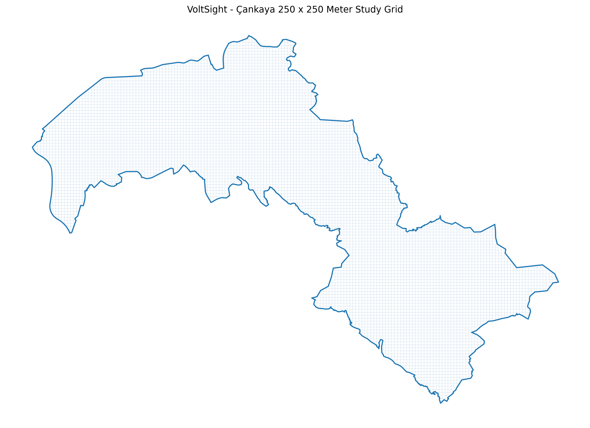
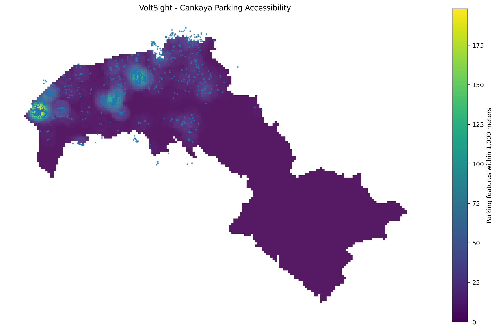

# VoltSight

**Explainable AI for intelligent EV charging station site selection and urban infrastructure planning.**

VoltSight is an end-to-end artificial intelligence and geospatial data science project that identifies suitable locations for new electric vehicle charging stations.

The system combines open geospatial data, spatial feature engineering, machine learning and explainable AI to evaluate urban areas and generate charging station suitability scores.

## Study Area

The first version of VoltSight focuses on **Çankaya, Ankara, Türkiye**.

The Çankaya administrative boundary is divided into fixed **250 × 250 meter grid cells**. Each grid cell will be evaluated using transportation, infrastructure, land-use and urban activity features.

## Current Progress

The following steps have been completed:

- Project repository and folder structure were initialized.
- Python virtual environment was configured.
- Data science and geospatial dependencies were installed.
- The Çankaya administrative boundary was acquired from OpenStreetMap.
- The boundary was transformed into a meter-based projected coordinate system.
- A 250 × 250 meter spatial analysis grid was generated.
- GeoPackage and GeoJSON grid outputs were created locally.
- A grid preview image and technical summary were generated.
- Automated geometry, schema, coordinate system and grid integrity tests were added using Pytest.
- Automated integrity tests were added for road geometries, road lengths, density calculations, nearest-main-road distances and machine-learning outputs.
- OpenStreetMap parking features were collected for Çankaya and its surrounding buffer.
- Grid-level parking accessibility, area, capacity and proximity features were generated.
- Automated integrity tests were added for parking geometries, radius counts, distance calculations, area ratios and machine-learning outputs.
The project is currently entering the **spatial feature collection and feature engineering phase**.

## Study Grid Preview



The grid cells shown above form the basic analysis units of VoltSight. Machine learning features and suitability predictions will be calculated separately for each cell.

## Project Goals

- Collect and process open geospatial datasets
- Build a reproducible spatial data pipeline
- Generate fixed-size urban analysis grids
- Extract transportation and urban activity features
- Train and compare machine learning models
- Produce charging station suitability scores
- Explain predictions using SHAP
- Estimate prediction uncertainty
- Serve model results through a FastAPI backend
- Visualize results using React and OpenLayers
- Package the project using Docker
- Track machine learning experiments using MLflow

## Planned Spatial Features

Each grid cell will eventually contain features such as:

- Distance to the nearest main road
- Total road length and road density
- Number of nearby parking areas
- Distance to the nearest parking area
- Number of nearby points of interest
- Commercial activity density
- Residential activity density
- Distance to existing charging stations
- Number of existing charging stations within a defined radius
- Distance to electrical infrastructure
- Population and urban density indicators
- Hospital, university and shopping center proximity
- Fuel station proximity
- Public transport accessibility
- Land-use characteristics

## Methodology

The planned VoltSight workflow is:

```text
Open Geospatial Data
        |
        v
Data Cleaning and Validation
        |
        v
250 x 250 Meter Analysis Grid
        |
        v
Spatial Feature Engineering
        |
        v
Exploratory Data Analysis
        |
        v
Baseline Machine Learning Models
        |
        v
Advanced Suitability Model
        |
        v
SHAP Explanations and Uncertainty Analysis
        |
        v
FastAPI Backend
        |
        v
React and OpenLayers Web Application
```

## Study Grid Generation

The study grid pipeline performs the following operations:

1. Queries OpenStreetMap for the Çankaya administrative boundary.
2. Validates that the returned geometry is a polygon.
3. Stores the original boundary in EPSG:4326.
4. Estimates an appropriate local UTM coordinate system.
5. Transforms the boundary into a meter-based coordinate system.
6. Generates fixed 250 × 250 meter square cells.
7. Retains cells whose center points fall inside the Çankaya boundary.
8. Assigns a unique identifier to every retained grid cell.
9. Calculates grid center coordinates and cell areas.
10. Produces local GeoPackage, GeoJSON, preview and summary outputs.
## Road Feature Engineering

The OpenStreetMap drivable road network was downloaded for Çankaya and an additional one-kilometer buffer around the district.

Road geometries were intersected with each 250 × 250 meter analysis cell. The following features were generated for every grid cell:

- `road_length_m`
- `road_segment_count`
- `main_road_length_m`
- `main_road_segment_count`
- `road_density_km_per_km2`
- `distance_to_main_road_m`
- `nearest_main_road_type`

The generated dataset contains 7,227 grid records.
## Parking Feature Engineering

OpenStreetMap parking features were collected using the
`amenity=parking` tag for Çankaya and an additional one-kilometer
buffer around the district.

Each parking record was cleaned, projected into the analysis
coordinate system and assigned a unique identifier.

The following grid-level features were generated:

- `parking_count`
- `parking_area_m2`
- `parking_area_ratio`
- `distance_to_nearest_parking_m`
- `parking_count_within_500m`
- `parking_count_within_1000m`
- `known_parking_capacity`
- `parking_capacity_record_count`

Polygon parking areas were intersected with the 250 × 250 meter
analysis grid. Representative points were used for local assignment
and radius-based accessibility counts.

OpenStreetMap parking coverage and capacity attributes may be
incomplete. These features represent mapped parking accessibility,
not a complete official parking inventory.



### Initial Road Statistics

- Grid cells containing road data: 3,346
- Grid cells without road data: 3,881
- Mean road density: 5.48 km/km²
- Median distance to a main road: 375.49 meters
- Maximum distance to a main road: 4,037.23 meters

The road-feature pipeline and outputs are validated through automated Pytest checks.

## Generated Grid Outputs

The current pipeline generates the following files:

```text
data/raw/cankaya_boundary_osm.geojson
data/processed/cankaya_grid_250m.gpkg
data/processed/cankaya_grid_250m.geojson
docs/cankaya_grid_preview.png
docs/cankaya_grid_summary.md
```

Large generated data files are excluded from Git using `.gitignore`. They can be reproduced by running the data pipeline.

## Planned Technologies

### Data Science and Machine Learning

- Python
- NumPy
- Pandas
- GeoPandas
- Scikit-learn
- XGBoost
- LightGBM
- SHAP
- Matplotlib
- JupyterLab

### Geospatial Processing

- OpenStreetMap
- OSMnx
- Shapely
- PyProj
- Pyogrio
- GeoJSON
- GeoPackage

### Backend and Data Storage

- FastAPI
- PostgreSQL
- PostGIS
- Pydantic

### Frontend and Visualization

- React
- OpenLayers
- JavaScript
- HTML
- CSS

### Engineering and MLOps

- Git
- GitHub
- Docker
- MLflow
- Pytest

## Project Structure

```text
voltsight-ai/
|-- backend/
|   `-- app/
|       |-- core/
|       |-- routers/
|       |-- schemas/
|       |-- services/
|       |-- __init__.py
|       `-- main.py
|
|-- data/
|   |-- raw/
|   |-- interim/
|   `-- processed/
|
|-- docs/
|   |-- cankaya_grid_preview.png
|   `-- cankaya_grid_summary.md
|
|-- frontend/
|
|-- notebooks/
|
|-- src/
|   `-- voltsight/
|       |-- data/
|       |   |-- __init__.py
|       |   `-- create_study_grid.py
|       |
|       |-- evaluation/
|       |-- features/
|       |-- models/
|       `-- __init__.py
|
|-- tests/
|-- .gitignore
|-- README.md
`-- requirements.txt
```

## Local Installation

Clone the repository:

```bash
git clone https://github.com/YOUR-GITHUB-USERNAME/voltsight-ai.git
```

Enter the project directory:

```bash
cd voltsight-ai
```

Create a Python virtual environment:

```bash
python -m venv .venv
```

Activate the virtual environment on Windows PowerShell:

```powershell
Set-ExecutionPolicy -Scope Process -ExecutionPolicy Bypass
.\.venv\Scripts\Activate.ps1
```

Install project dependencies:

```bash
python -m pip install --upgrade pip
python -m pip install -r requirements.txt
```

## Running the Study Grid Pipeline

Run the Çankaya boundary and grid generation pipeline from the project root:

```bash
python src/voltsight/data/create_study_grid.py
```

When the pipeline completes successfully, it creates:

- The Çankaya boundary
- The 250 × 250 meter analysis grid
- A GeoPackage output
- A GeoJSON output
- A grid preview image
- A Markdown summary report

## Data Policy

VoltSight is designed to use public and openly licensed datasets.

Large raw, intermediate and processed data files are not stored directly in the Git repository. The repository instead contains reproducible Python pipelines that acquire and generate the required datasets.

Private, restricted or non-public datasets must not be added to the repository without permission.

## Roadmap

### Phase 1 — Project Initialization

- [x] Create the GitHub repository
- [x] Configure the Python virtual environment
- [x] Create the full-stack project structure
- [x] Add project documentation
- [x] Configure Git ignore rules

### Phase 2 — Study Area Preparation

- [x] Acquire the Çankaya administrative boundary
- [x] Transform the boundary into a projected coordinate system
- [x] Generate 250 × 250 meter analysis grids
- [x] Create the grid preview and summary
- [x] Validate the study grid geometries
- [x] Add automated tests for the grid pipeline

### Phase 3 — Spatial Data Collection

- [x] Collect the road network
- [x] Calculate grid-level road features
- [x] Validate road-feature outputs with automated tests
- [x] Collect parking areas
- [x] Calculate grid-level parking features
- [x] Validate parking-feature outputs with automated tests
- [ ] Collect existing charging stations
- [ ] Collect shopping centers and commercial locations
- [ ] Collect hospitals and universities
- [ ] Collect fuel stations
- [ ] Collect public transport features
- [ ] Collect residential and commercial land-use information
### Phase 4 — Feature Engineering

- [ ] Calculate distance to main roads
- [ ] Calculate road density
- [ ] Calculate nearby point-of-interest counts
- [ ] Calculate parking accessibility
- [ ] Calculate existing charging station density
- [ ] Calculate distance-based urban features
- [ ] Build the final machine learning dataset
- [ ] Validate missing values and spatial consistency

### Phase 5 — Machine Learning

- [ ] Perform exploratory data analysis
- [ ] Define target labels and control samples
- [ ] Train a Logistic Regression baseline
- [ ] Train a Random Forest baseline
- [ ] Train an XGBoost model
- [ ] Compare model performance
- [ ] Perform spatial cross-validation
- [ ] Tune model hyperparameters

### Phase 6 — Explainable AI

- [ ] Add SHAP global explanations
- [ ] Add grid-level local explanations
- [ ] Calculate prediction confidence
- [ ] Add uncertainty indicators
- [ ] Analyze model limitations and possible bias

### Phase 7 — Backend

- [ ] Initialize the FastAPI application
- [ ] Add health-check endpoints
- [ ] Add grid and suitability endpoints
- [ ] Integrate the trained model
- [ ] Connect PostgreSQL and PostGIS
- [ ] Add request validation
- [ ] Add backend tests

### Phase 8 — Frontend

- [ ] Initialize the React application
- [ ] Integrate OpenLayers
- [ ] Display the Çankaya grid
- [ ] Color grid cells by suitability score
- [ ] Display prediction explanations
- [ ] Add filters and layer controls
- [ ] Add candidate location details
- [ ] Add responsive interface design

### Phase 9 — Deployment and Documentation

- [ ] Add Docker configuration
- [ ] Add MLflow experiment tracking
- [ ] Add automated testing workflow
- [ ] Prepare architecture diagrams
- [ ] Prepare the final technical report
- [ ] Record a demo video
- [ ] Deploy the application

## Important Scientific Limitation

The first version of VoltSight will estimate **location suitability based on spatial patterns and available urban features**.

Unless real station utilization, energy consumption, occupancy or revenue data becomes available, the model results must not be interpreted as guaranteed demand, profitability or commercial success.

VoltSight will clearly distinguish between:

- Spatial suitability
- Predicted demand
- Financial feasibility
- Model confidence

This distinction is necessary for scientifically responsible and transparent machine learning.

## License

A project license will be selected after reviewing the licenses and attribution requirements of all external datasets used by VoltSight.

## Author

Developed as an end-to-end artificial intelligence, data science and software engineering portfolio project.