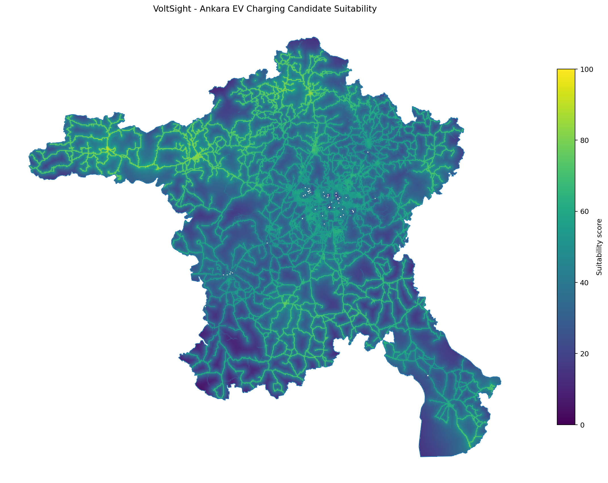
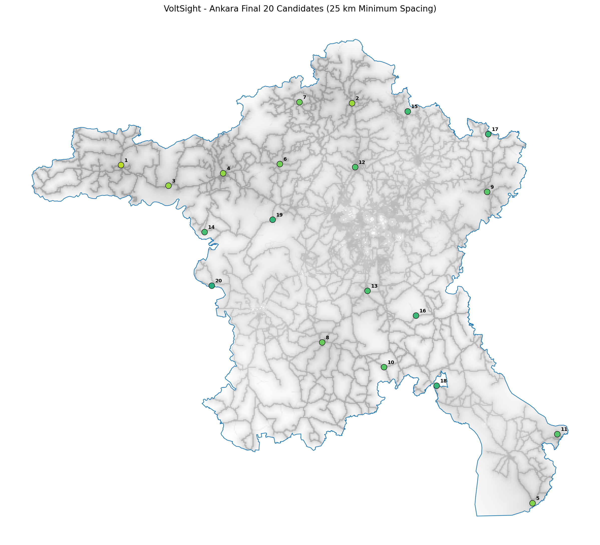

@'
# VoltSight

**Akıllı elektrikli araç şarj istasyonu yer seçimi için açıklanabilir mekânsal karar destek sistemi.**

VoltSight; yeni elektrikli araç şarj istasyonları için uygun bölgeleri belirlemek amacıyla açık coğrafi verileri, mekânsal özellik mühendisliğini, açıklanabilir skorlama yöntemlerini ve makine öğrenmesi için hazırlanmış veri kümelerini bir araya getiren uçtan uca bir veri bilimi projesidir.

Proje başlangıçta **Çankaya, Ankara** üzerinde 250 × 250 metre çözünürlüklü bir pilot çalışma olarak geliştirilmiş, daha sonra veri toplama ve analiz mimarisi **Ankara ili geneline** ölçeklenmiştir.

> VoltSight'ın mevcut ana çıktısı, bir istasyonun kurulması gerektiğine dair olasılık tahmini değil; erişilebilirlik, otopark uygulanabilirliği ve mevcut şarj altyapısı açığını birlikte değerlendiren **açıklanabilir bir uygunluk sıralamasıdır**.

---

## Ana Sonuçlar

| Ölçüt | Ankara |
|---|---:|
| Çalışma alanı | Ankara ili |
| Yaklaşık sınır alanı | 25.680,96 km² |
| Grid çözünürlüğü | 500 × 500 m |
| Grid hücresi | 102.745 |
| Birleştirilmiş yol parçaları | 177.714 |
| Toplam yol uzunluğu | 29.274,14 km |
| Benzersiz OSM otoparkı | 2.959 |
| Nihai analiz şarj istasyonu | 69 |
| Mevcut istasyon içeren grid | 46 |
| Yeni istasyon adayı grid | 102.699 |
| Eligibility filtresini geçen aday | 10.770 |
| Nihai shortlist | 20 |
| Minimum shortlist aralığı | 25 km |
| En yüksek suitability skoru | 92,5548 |
| En yüksek aday | `ANK_004429` |
| Shortlist minimum suitability | 70,4635 |
| Otomatik test | 300+ |

---

## Ankara Suitability Haritası



Harita, 102.699 yeni istasyon adayı grid hücresinin açıklanabilir suitability skorlarını göstermektedir.

Skorlar Ankara aday dağılımına göre göreli olarak hesaplanır. Bu nedenle yüksek skor, hücrenin Ankara içindeki diğer adaylara kıyasla güçlü bir uygulanabilirlik ve altyapı ihtiyacı kombinasyonuna sahip olduğunu ifade eder.

---

## Final 20 Aday Bölge



İlk suitability sıralamasından doğrudan ilk 20 hücreyi almak yerine, yatırım önerilerinin birbirinin hemen yanında kümelenmesini engellemek amacıyla mekânsal çeşitlilik kuralı uygulanmıştır.

Final shortlist:

- En az 60 suitability
- En az 60 feasibility
- En az 50 need
- Adaylar arasında en az 25 km mesafe
- Toplam 20 aday

koşullarını kullanır.

25 km minimum aralık altında:

- 20 aday seçilmiştir.
- Gözlenen minimum mesafe 25,10 km'dir.
- Seçilen en düşük suitability skoru 70,4635'tir.
- Seçilen en düşük feasibility skoru 68,9182'dir.
- Seçilen en düşük need skoru 56,0840'tır.
- Shortlist'e giren en düşük orijinal suitability sırası 5.815'tir.

Bu yaklaşım, yalnızca yüksek skor üretmek yerine Ankara geneline yayılmış farklı yatırım bölgeleri önermeyi amaçlar.

---

# Proje Mimarisi

VoltSight Ankara veri hattı aşağıdaki temel aşamalardan oluşur:

```text
Ankara Administrative Boundary
              |
              v
       500 x 500 m Grid
              |
              v
     Road Data Collection
              |
              v
   Road Feature Engineering
              |
              v
    Parking Data Collection
              |
              v
 Parking Feature Engineering
              |
              v
  Charging Station Inventory
              |
              v
Charging Feature Engineering
              |
              v
 Leakage-Safe Model Dataset
              |
              v
    Candidate Site Dataset
              |
              v
Explainable Suitability Scoring
              |
              v
     Eligibility Filters
              |
              v
  Spatial Diversity Selection
              |
              v
       Final 20 Sites
       Çalışma Alanları
Çankaya Pilot Çalışması

VoltSight'ın ilk prototipi Çankaya üzerinde geliştirilmiştir.

Çankaya çalışması:

250 × 250 metre grid çözünürlüğü
7.227 grid hücresi
Yol, otopark ve şarj altyapısı özellikleri
7.217 yeni istasyon adayı
Explainable suitability scoring
20 adaylık mekânsal shortlist

üretmiştir.

Pilot çalışma, veri modellerinin, özellik mühendisliği fonksiyonlarının, leakage politikasının ve suitability metodolojisinin geliştirilmesi için kullanılmıştır.

Ankara Ölçeklendirmesi

Pilot mimari daha sonra Ankara ilinin tamamına ölçeklenmiştir.

Ankara çalışmasında:

Grid çözünürlüğü:    500 m
Grid sayısı:         102.745
Analiz CRS:          EPSG:32636
Grid ID formatı:     ANK_000001 ...

kullanılmaktadır.

Büyük veri hacmi nedeniyle yol ve otopark veri toplama süreçlerinde parçalı ve yeniden devam ettirilebilir veri hatları geliştirilmiştir.

Yol Veri Hattı

Ankara'nın tamamındaki OpenStreetMap sürüş ağı tek sorguda işlenmek yerine 8 km'lik çekirdek parçalara ayrılmıştır.

Yol indirme mimarisi:

8 km core chunk
     +
1 km download buffer
     |
     v
Overpass / OSMnx
     |
     v
Per-chunk cache
     |
     v
Resume support
     |
     v
Core clipping
     |
     v
Unified Ankara road network

Birleştirme sonucunda:

Final road pieces:       177.714
Main-road pieces:         54.180
Total road length:     29.274,14 km

elde edilmiştir.

Grid seviyesinde başlıca yol özellikleri:

road_length_m
road_segment_count
main_road_length_m
main_road_segment_count
road_density_km_per_km2
distance_to_main_road_m

Ankara grid sonuçları:

Road data içeren grid:       28.676
Road data içermeyen grid:    74.069
Ortalama yol yoğunluğu:        1,14 km/km²
Ana yola medyan uzaklık:     958,35 m
Ana yola maksimum uzaklık: 23.080,08 m
Otopark Veri Hattı

OpenStreetMap üzerindeki amenity=parking nesneleri Ankara için parçalı olarak indirilmiş ve tekrar eden kayıtlar OSM kimlikleri üzerinden birleştirilmiştir.

Ham chunk kayıtlarından:

Raw parking records:       4.623
Duplicate records removed: 1.664
Unique parking features:   2.959
Known-capacity features:     113

elde edilmiştir.

Grid seviyesinde üretilen özellikler:

parking_count
parking_area_m2
parking_area_ratio
distance_to_nearest_parking_m
parking_count_within_500m
parking_count_within_1000m
known_parking_capacity
parking_capacity_record_count

Ankara sonuçları:

Otopark içeren grid:                  984
500 m içinde otopark bulunan grid:  1.906
1 km içinde otopark bulunan grid:   3.960
Medyan en yakın otopark mesafesi: 11.823,59 m
Maksimum mesafe:                  64.185,46 m
Veri sınırlaması

OpenStreetMap otopark kapsamı ve kapasite bilgileri eksik olabilir.

Bu değişkenler resmi ve eksiksiz bir otopark envanterini değil, haritalanmış otopark erişilebilirliğini temsil eder.

Şarj İstasyonu Veri Hattı

Şarj istasyonu verisi yol verisine göre oldukça seyrek olduğu için 488 ayrı sorgu kullanmak yerine Ankara genelini kapsayan tek bir seyrek Overpass sorgusu geliştirilmiştir.

OpenStreetMap sorgusu:

amenity=charging_station

etiketini kullanmaktadır.

Ankara-wide sorgu, Çankaya pilotundaki 18 bilinen OSM istasyonunun 18'ini de yeniden bulmuştur.

Nihai analiz envanteri:

OSM station:                 68
Reviewed EPDK supplement:     1
Final analysis stations:     69
Mapped AC stations:          13
Mapped DC stations:           7
Known-capacity stations:     23

EPDK bileşeni, Çankaya pilotunda daha önce incelenmiş tek koordinat destek kaydıdır.

Bu kayıt Ankara geneli için eksiksiz bir EPDK istasyon envanteri olarak yorumlanmamalıdır.

Grid seviyesinde üretilen özellikler:

charging_station_count
has_existing_charging_station
distance_to_nearest_charging_station_m
charging_station_count_within_1000m
charging_station_count_within_2000m
known_charging_capacity
charging_capacity_record_count
ac_station_count_within_1000m
dc_station_count_within_1000m

Ankara sonuçları:

Grid sayısı:                              102.745
İstasyon içeren grid:                          46
1 km içinde istasyon bulunan grid:            463
2 km içinde istasyon bulunan grid:          1.399
Medyan en yakın istasyon mesafesi:      31.631,14 m
Maksimum en yakın istasyon mesafesi:   125.676,81 m
Leakage-Safe Model Dataset

Mevcut şarj istasyonu dağılımını tahmin etmeyi amaçlayan bir modelde şarj istasyonlarından türetilen değişkenlerin predictor olarak kullanılması ciddi veri sızıntısına neden olabilir.

Bu nedenle VoltSight, model geliştirme veri kümesini ve site-selection veri kümesini birbirinden ayırır.

Training Dataset
Rows:                    102.745
Predictor features:           14
Positive target rows:         46
Negative target rows:    102.699
Charging leakage:              0

Training predictor'ları yalnızca yol ve otopark özelliklerinden oluşur.

Şarj altyapısından türetilen:

distance_to_nearest_charging_station_m
charging_station_count_within_1000m
charging_station_count_within_2000m
ac_station_count_within_1000m
dc_station_count_within_1000m

değişkenleri mevcut istasyon hedefini öğrenen modelin predictor'ları arasına alınmaz.

Candidate Dataset

Mevcut şarj istasyonu bulunan gridler çıkarıldığında:

Candidate rows: 102.699

kalır.

Candidate suitability analizinde ise mevcut altyapı açığı karar probleminin doğrudan bir bileşeni olduğu için charging context kullanılabilir.

Bu iki görev metodolojik olarak birbirinden ayrılmıştır.

Explainable Suitability Model

VoltSight suitability skoru dört açıklanabilir alt bileşen üzerine kuruludur.

Accessibility
Main-road proximity     45%
Main-road presence      35%
Road density            20%
Parking
Nearest parking proximity   45%
Parking within 1 km          35%
Local parking area           20%
Infrastructure Gap
Nearest charging distance    75%
Station scarcity within 2 km 25%
Technology Gap
DC absence within 1 km       60%
AC absence within 1 km       40%

Daha sonra:

Feasibility =
    60% Accessibility
    +
    40% Parking

Need =
    85% Infrastructure Gap
    +
    15% Technology Gap

hesaplanır.

Final uygunluk skoru:

Suitability = sqrt(Feasibility × Need)

geometrik ortalamasıyla üretilir.

Geometrik ortalama kullanılması, yalnızca feasibility veya yalnızca need değeri çok yüksek olan dengesiz adayların final skorda aşırı öne çıkmasını sınırlar.

Ankara Suitability Sonuçları
Candidate count:          102.699
Median suitability:         45,63
Maximum suitability:        92,55
Minimum suitability:         1,88

Priority A:                1.027
Priority B:                4.108
Priority C:               15.405
Priority D:               30.810
Priority E:               51.349

En yüksek aday:

Grid ID:             ANK_004429
Suitability score:      92,5548
Feasibility score:      98,87
Need score:             86,65

Priority band'leri Ankara aday dağılımındaki göreli yüzdeliklere göre oluşturulur.

Suitability skoru bir yatırım karar destek sıralamasıdır; finansal getiri, istasyon kullanımı veya ticari başarı olasılığı değildir.

Spatially Diverse Shortlist

Yüksek puanlı hücrelerin aynı yol koridoru veya aynı kent bölgesinde kümelenmesini önlemek için greedy spatial-diversity algoritması uygulanır.

Eligibility:

Suitability >= 60
Feasibility >= 60
Need >= 50

Eligibility filtresi sonrası:

10.770 candidate

kalmaktadır.

Ankara ölçeği için farklı minimum spacing değerleri değerlendirilmiştir.

25 km eşiği:

20 aday üretmeye devam eder.
Minimum shortlist suitability değerini 70'in üzerinde tutar.
Ankara geneline belirgin coğrafi yayılım sağlar.

Final:

Selected candidates:          20
Minimum observed spacing:  25,10 km
Worst original rank:       5.815
Lowest suitability:        70,4635
Lowest feasibility:        68,9182
Lowest need:               56,0840

Spatial diversity yalnızca final shortlist seçiminde uygulanır.

Adayların orijinal suitability skorları değiştirilmez.

Sonuç Görselleştirmeleri

Proje aşağıdaki Ankara sonuç görsellerini üretmektedir:

docs/ankara_suitability_map.png
docs/ankara_final_shortlist_map.png
docs/ankara_suitability_distribution.png
docs/ankara_feasibility_need_plot.png

ankara_suitability_map.png, Ankara genelindeki göreli uygunluk dağılımını gösterir.

ankara_final_shortlist_map.png, 25 km minimum mekânsal ayrım sonrasında elde edilen 20 final yatırım bölgesini gösterir.

ankara_feasibility_need_plot.png, adayların uygulanabilirlik ve altyapı ihtiyacı arasındaki dengesini görselleştirir.

Test ve Veri Doğrulama

VoltSight veri hatlarında Pytest tabanlı otomatik kontroller kullanılmaktadır.

Test edilen konular arasında:

CRS doğruluğu
grid ID benzersizliği
geometri geçerliliği
eksik değer kontrolleri
yol uzunlukları
yol yoğunluğu
en yakın yol mesafesi
otopark yarıçap sayımları
otopark alanları
charging radius count ilişkileri
AC/DC özellikleri
veri sızıntısı politikası
suitability score sınırları
priority band mantığı
spatial shortlist mesafe kuralı
visualization dataset doğrulaması

bulunmaktadır.

Proje test paketi 300'den fazla otomatik testi başarıyla geçmektedir.

Testleri çalıştırmak için:

python -m pytest -q
Proje Yapısı
voltsight-ai/
|
|-- data/
|   |-- raw/
|   |-- interim/
|   `-- processed/
|
|-- docs/
|   |-- ankara_suitability_map.png
|   |-- ankara_final_shortlist_map.png
|   |-- ankara_suitability_distribution.png
|   |-- ankara_feasibility_need_plot.png
|   `-- technical summaries
|
|-- src/
|   `-- voltsight/
|       |
|       |-- core/
|       |   `-- study_areas.py
|       |
|       |-- data/
|       |   |-- create_study_grid.py
|       |   |-- merge_charging_station_sources.py
|       |   `-- merge_ankara_charging_sources.py
|       |
|       |-- features/
|       |   |-- create_road_features.py
|       |   |-- create_parking_features.py
|       |   |-- create_charging_features.py
|       |   |-- create_ankara_road_chunk_plan.py
|       |   |-- download_ankara_road_chunks.py
|       |   |-- merge_ankara_road_chunks.py
|       |   |-- create_ankara_road_features.py
|       |   |-- download_ankara_parking_chunks.py
|       |   |-- merge_ankara_parking_chunks.py
|       |   |-- create_ankara_parking_features.py
|       |   |-- download_ankara_charging_fast.py
|       |   |-- create_ankara_charging_features.py
|       |   `-- create_ankara_model_dataset.py
|       |
|       `-- models/
|           |-- create_suitability_scores.py
|           |-- create_diverse_candidate_shortlist.py
|           |-- create_ankara_suitability_scores.py
|           |-- create_ankara_diverse_candidate_shortlist.py
|           `-- create_ankara_result_visualizations.py
|
|-- tests/
|-- notebooks/
|-- backend/
|-- frontend/
|-- pytest.ini
|-- requirements.txt
`-- README.md
Yerel Kurulum

Depoyu klonlayın:

git clone https://github.com/ilginbor/voltsight-ai.git
cd voltsight-ai

Sanal ortam oluşturun:

python -m venv .venv

Windows PowerShell üzerinde etkinleştirin:

Set-ExecutionPolicy -Scope Process -ExecutionPolicy Bypass
.\.venv\Scripts\Activate.ps1

Bağımlılıkları kurun:

python -m pip install --upgrade pip
python -m pip install -r requirements.txt

Testleri çalıştırın:

python -m pytest -q
Ankara Pipeline
1. Study Grid
python ".\src\voltsight\data\create_study_grid.py" `
    --study-area ankara `
    --grid-size-m 500 `
    --reuse-boundary
2. Road Pipeline
python ".\src\voltsight\features\create_ankara_road_chunk_plan.py"

python ".\src\voltsight\features\download_ankara_road_chunks.py" `
    --all `
    --start-order 1

python ".\src\voltsight\features\merge_ankara_road_chunks.py"

python ".\src\voltsight\features\create_ankara_road_features.py"

Road downloader yeniden çalıştırıldığında başarıyla tamamlanan chunk'ları metadata üzerinden atlar ve eksik parçalardan devam eder.

3. Parking Pipeline
python ".\src\voltsight\features\download_ankara_parking_chunks.py" `
    --all `
    --start-order 1

python ".\src\voltsight\features\merge_ankara_parking_chunks.py"

python ".\src\voltsight\features\create_ankara_parking_features.py" `
    --batch-size 5000 `
    --skip-preview
4. Charging Pipeline
python ".\src\voltsight\features\download_ankara_charging_fast.py"

python ".\src\voltsight\data\merge_ankara_charging_sources.py"

python ".\src\voltsight\features\create_ankara_charging_features.py" `
    --batch-size 5000 `
    --skip-preview
5. Model Dataset
python ".\src\voltsight\features\create_ankara_model_dataset.py"
6. Suitability Scoring
python ".\src\voltsight\models\create_ankara_suitability_scores.py"
7. Spatial Shortlist
python ".\src\voltsight\models\create_ankara_diverse_candidate_shortlist.py"
8. Result Visualizations
python ".\src\voltsight\models\create_ankara_result_visualizations.py"
Kullanılan Teknolojiler
Veri Bilimi
Python
NumPy
Pandas
GeoPandas
Matplotlib
Coğrafi Veri İşleme
OpenStreetMap
OSMnx
Shapely
PyProj
Pyogrio
GeoPackage
GeoJSON
Yazılım Mühendisliği
Git
GitHub
Pytest
Chunk-based processing
Checkpointing
Metadata-based resume
Reproducible pipelines
Planlanan Makine Öğrenmesi ve Uygulama Katmanı
Scikit-learn
XGBoost / gradient boosting alternatives
Spatial cross-validation
SHAP
FastAPI
PostgreSQL / PostGIS
React
OpenLayers
Docker
MLflow
Bilimsel ve Veri Kaynağı Sınırlamaları

VoltSight sonuçları kullanılan açık veri kaynaklarının kapsamına bağlıdır.

OpenStreetMap:

yol ağı açısından güçlü bir kaynak olmakla birlikte,
otopark envanterinde eksikler içerebilir,
charging station kapasite ve connector etiketlerinde eksik değerler içerebilir.

EPDK bileşeni Ankara geneli için eksiksiz koordinatlı istasyon envanteri değildir.

Ayrıca mevcut çalışma:

gerçek istasyon kullanım oranını,
enerji tüketimini,
istasyon doluluğunu,
gelir veya kârlılık verisini,
elektrik dağıtım şebekesi kapasitesini

doğrudan modellememektedir.

Bu nedenle suitability sonuçları:

garantili talep, finansal kârlılık veya kesin yatırım kararı olarak yorumlanmamalıdır.

VoltSight aşağıdaki kavramları birbirinden ayırmayı amaçlar:

Mekânsal uygunluk
Altyapı ihtiyacı
Tahmin edilen talep
Finansal uygulanabilirlik
Model güveni
Sonraki Aşamalar

Mevcut Ankara mekânsal veri ve suitability pipeline'ı tamamlandıktan sonra planlanan çalışmalar:

Exploratory Data Analysis
Class-imbalance aware baseline models
Spatial cross-validation
Model comparison
SHAP explainability
Prediction uncertainty
Additional urban-demand features
Population / land-use integration
Electrical-infrastructure features
FastAPI inference layer
React + OpenLayers visualization
Docker packaging
MLflow experiment tracking

Özellikle mevcut istasyon hedefinde yalnızca 46 pozitif grid bulunması nedeniyle model değerlendirmesinde accuracy tek başına kullanılmayacaktır.

Precision, recall, PR-AUC ve mekânsal doğrulama yöntemleri gibi imbalance-aware metrikler öncelikli olacaktır.

Veri Politikası

VoltSight kamuya açık ve uygun kullanım koşullarına sahip veri kaynaklarıyla çalışacak şekilde tasarlanmıştır.

Büyük ham, ara ve işlenmiş veri dosyaları doğrudan Git deposunda tutulmaz.

Bunun yerine:

download
clean
merge
validate
feature engineering
scoring
visualization

adımlarını tekrar üretilebilir hale getiren Python pipeline'ları sürüm kontrolünde tutulur.

Lisans

Projede kullanılan dış veri kaynaklarının lisans ve atıf koşulları dikkate alınmaktadır.

Proje için nihai yazılım lisansı, dış veri kaynakları ve dağıtım modeli kesinleştirildikten sonra belirlenecektir.

Geliştirici

Ilgın Bor

Bilgisayar Mühendisliği öğrencisi.

İlgi alanları:

Artificial Intelligence
Data Science
Machine Learning
Cybersecurity
Geospatial Data Science